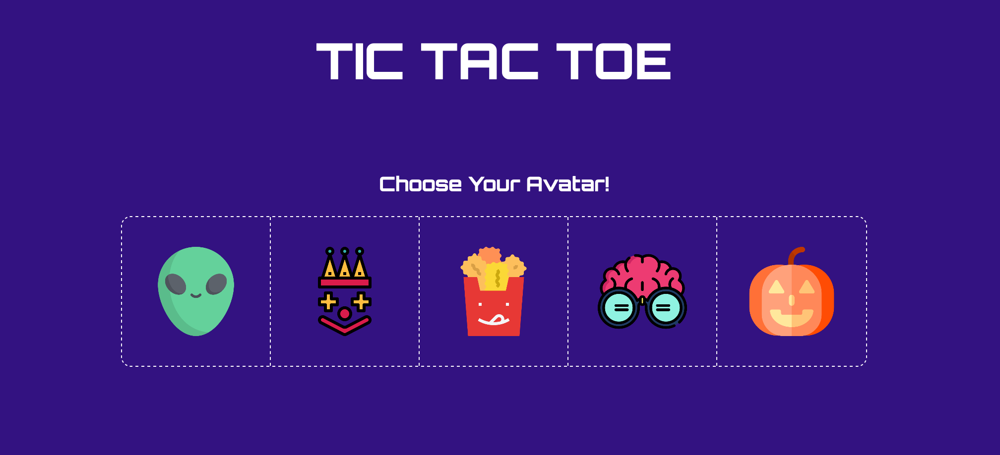
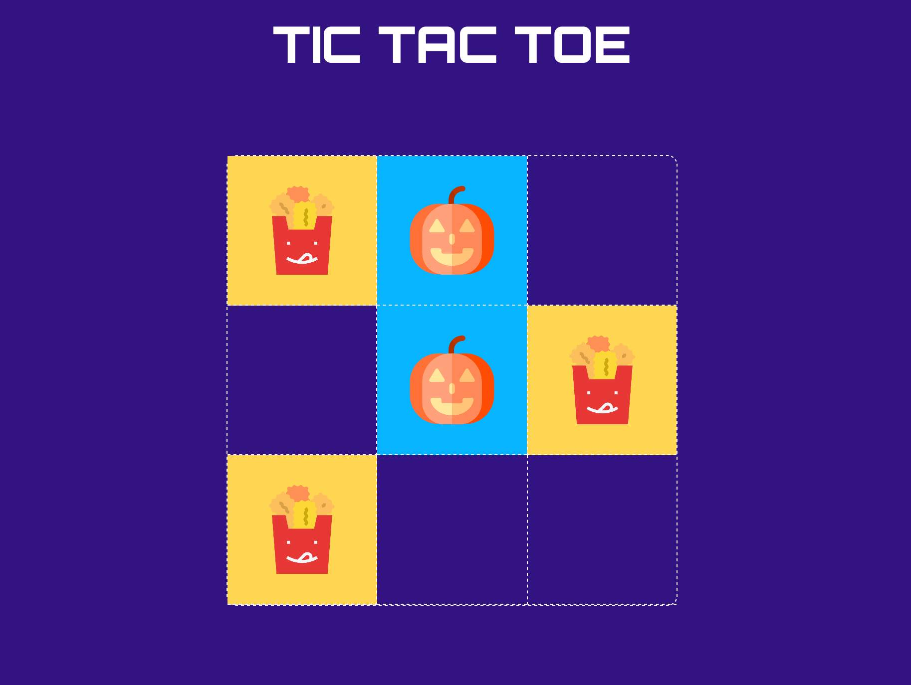
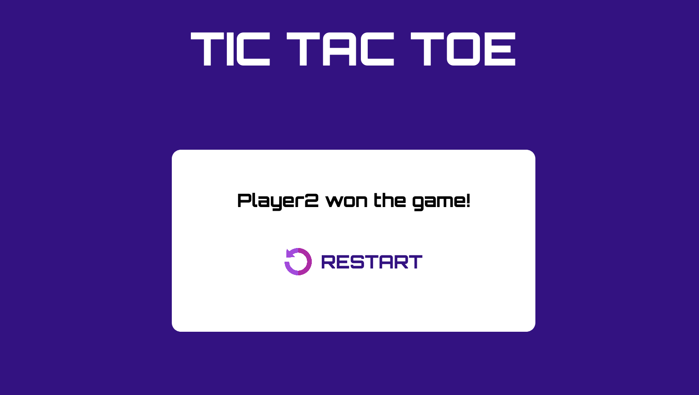

<p align="center">
  
</p>

## Live TicTacToe Game


[](https://forthebadge.com)

Play TicTacToe live with your friends! Create a Room or join one. Choose your Avatar and you are good to go!


## Installation

```bash
npm i
npm start
```


## Build
[](https://app.netlify.com/sites/livetictactoe/deploys)


## Web View





